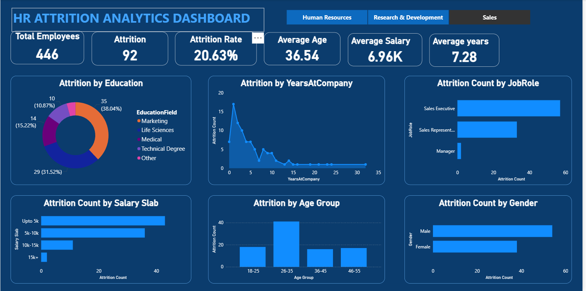

# Data-Analyst-Portfolio
# HR Attrition Analytics Dashboard

## Project Overview

The **HR Attrition Analytics Dashboard** is an interactive Power BI report designed to analyze employee attrition patterns within an organization. The dashboard provides insights into workforce trends, helping HR teams and business leaders understand the key factors influencing employee turnover.

This project focuses on transforming raw HR data into meaningful visual insights using data visualization and business intelligence techniques.

---

## Objectives

* Analyze employee attrition trends within the organization
* Identify key factors contributing to employee turnover
* Provide HR decision-makers with actionable insights
* Demonstrate the use of Power BI for data visualization and dashboard development

---

## Key Metrics (KPIs)

The dashboard includes the following key performance indicators:

* **Total Employees** – Total number of employees in the dataset
* **Attrition Count** – Number of employees who left the organization
* **Attrition Rate** – Percentage of employee turnover
* **Average Age** – Average age of employees
* **Average Salary** – Average employee salary
* **Average Years at Company** – Average tenure of employees

---

## Dashboard Insights

The dashboard highlights several important workforce insights:

* Attrition trends based on **Education Field**
* Attrition distribution by **Years at Company**
* Attrition comparison across **Job Roles**
* Attrition analysis by **Salary Slabs**
* Employee turnover patterns by **Age Group**
* Attrition differences between **Male and Female employees**

---

## Tools & Technologies Used

* **Power BI Desktop**
* Data Visualization
* Data Modeling
* DAX (Data Analysis Expressions)

---

## Skills Demonstrated

This project demonstrates the following data analytics skills:

* Data Visualization & Dashboard Design
* Business Intelligence Reporting
* Data Analysis & Insight Generation
* KPI Development
* Data Storytelling

---

## Dataset

The dataset used in this project is based on the **IBM HR Analytics Employee Attrition Dataset**, which contains employee demographic information, job roles, salary details, and attrition status.

---

## Dashboard Preview

---

## Project Outcome

This dashboard helps stakeholders quickly identify patterns in employee turnover and provides a clear visual representation of workforce dynamics. The insights generated can support better HR strategies and employee retention initiatives.

---
If you found this project interesting, feel free to connect with me on LinkedIn(https://www.linkedin.com/in/hemant-barai-86486a220).
